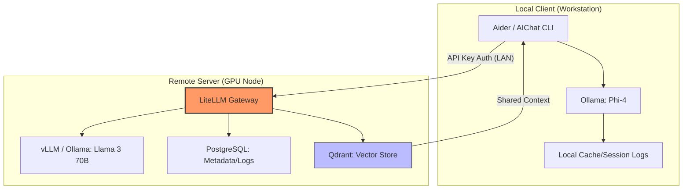
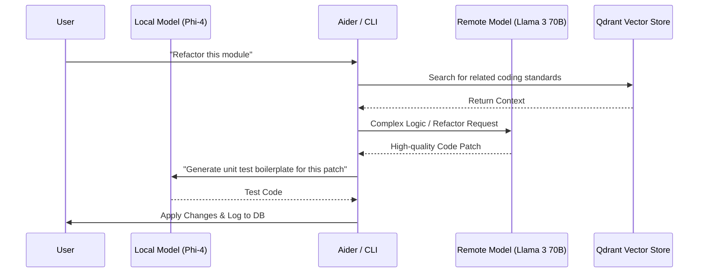
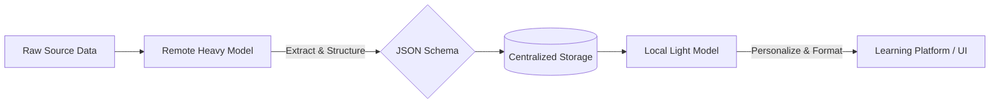
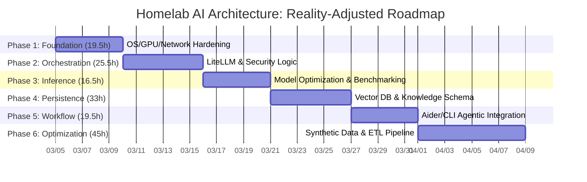
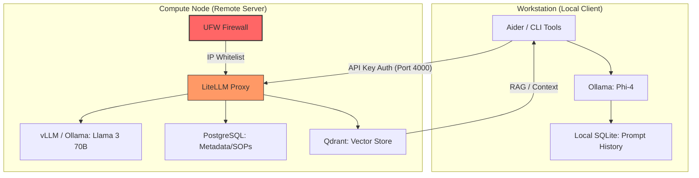
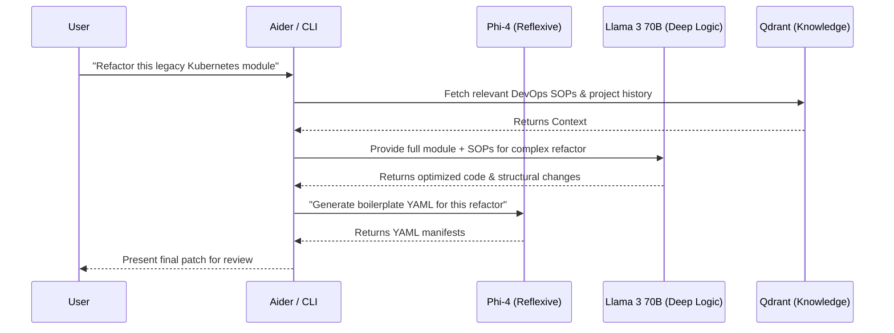
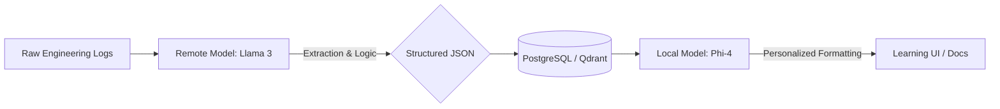

Prompt
======

# Homelab AI Architecture Prompt

Act as a Senior Systems Architect and MLOps Engineer. I want to design a secure, self-hosted AI infrastructure for a **dedicated homelab environment** restricted entirely to my **local network (LAN)**. 

**1. Infrastructure Split:**
* **Dedicated Remote Server:** For 'Heavy' models (e.g., Llama 3 70B), acting as a centralized inference hub.
* **Local Client Device:** For 'Light' models (e.g., Phi-4), ensuring zero-latency for autocomplete and quick shell assistance.

**2. Networking & Security:**
* The system must run strictly on a **trusted LAN** with no external exposure (No Tailscale, No VPN).
* I require a **Gateway (LiteLLM)** or **Reverse Proxy** to provide **API Key authentication** on the remote server to protect GPU resources.
* Provide a strategy for **IP Whitelisting (UFW/Firewall)** so only specific client devices can communicate with the server.

**3. Long-Term Storage & Knowledge Management:**
* **Centralized Storage Layer:** Design a storage strategy (e.g., Vector Database like ChromaDB/Qdrant or a structured SQL/NoSQL DB) to store generated data, engineering logs, and project context for long-term use.
* **Shared Context:** Ensure both the 'heavy' and 'light' models can leverage this storage layer. The heavy model should write complex extracted data to it, while the light model should be able to query it for local personalization or quick retrieval.

**4. Professional Engineering & MLOps Workflows:**
* **Software Development:** Detail a workflow using **Aider** or similar tools where the AI can contextually edit local files, utilizing the remote 'heavy' model for complex logic and local models for boilerplate.
* **DevOps/MLOps Loop:** Explain how to use the CLI for log analysis, Kubernetes/Docker troubleshooting, and infrastructure-as-code (Terraform) generation, ensuring the model persists session context across these tasks using the storage layer.
* **CLI Persistence:** The terminal setup must support persistent memory, chat sessions, and custom 'roles' to save engineering preferences (e.g., coding standards, language preferences).

**5. Data Generation Pipeline:**
* Detail a workflow for **Synthetic Data Generation**. The remote 'heavy' model should handle raw source extraction into structured JSON and save it to the storage layer. The local 'light' model then pulls from this storage for final formatting and personalization for a learning platform.

**6. Technical Requirements for Output:**
* Generate the entire response using **Markdown syntax** for a clean, scannable document.
* Use **Mermaid diagrams** (flowcharts or sequence diagrams) to visualize:
   1. The network architecture including the centralized storage layer.
   2. The 'Agentic' workflow for software engineering.
   3. The data generation and retrieval pipeline.
* Provide a **Docker Compose** configuration for the remote server and examples of **AIChat/Aider** configurations for the client.


Result
======

This architecture is designed for maximum privacy and performance, transforming your homelab into a professional-grade AI development environment. By offloading heavy lifting to a dedicated server and keeping "reflexive" tasks local, we create a seamless MLOps loop that respects your LAN-only constraint.

---

## 1. System Architecture Overview

The core of this design is the **Inference Split**. We treat the remote server as a "compute utility" and the local machine as the "execution edge."

### Network & Infrastructure Diagram



---

## 2. Networking & Security Strategy

To maintain a **Zero-Trust LAN** posture without external VPNs:

* **LiteLLM Gateway:** Acts as the "Traffic Controller." It provides a single OpenAI-compatible endpoint for all models and enforces API key authentication to prevent unauthorized GPU consumption by other devices on your network.
* **IP Whitelisting (UFW):** We restrict access at the OS level. Only your specific workstation IP can talk to the server's AI ports.

**Implementation Command (on Remote Server):**

```bash
# Default deny incoming
sudo ufw default deny incoming
# Allow SSH from your IP only
sudo ufw allow from 192.168.1.50 to any port 22
# Allow LiteLLM API from your IP only
sudo ufw allow from 192.168.1.50 to any port 4000
sudo ufw enable

```

---

## 3. Centralized Storage & Shared Context

We utilize a **Dual-Database Strategy** to ensure the models have "memory" across sessions.

1. **Qdrant (Vector DB):** Stores embeddings of your engineering logs, documentation, and code snippets.
2. **PostgreSQL:** Stores structured session metadata, custom "roles," and project configurations.

Both the 'Heavy' and 'Light' models interact with these via a thin Python middleware or direct integration in tools like **Aider**. When the heavy model finishes a complex refactor, it writes the "Lessons Learned" to Qdrant, which the local light model can then retrieve during quick shell assistance.

---

## 4. Professional Engineering Workflows

### Agentic Software Engineering Workflow



### CLI Persistence & DevOps Loop

For MLOps tasks (log analysis, Terraform generation), use **AIChat** with a configured `roles.yaml`. This allows you to switch personas instantly:

* **Role: `sys-admin**` -> Optimized for generating `kubectl` commands.
* **Role: `ml-engineer**` -> Optimized for PyTorch debugging.

---

## 5. Synthetic Data Generation Pipeline

This pipeline automates the creation of high-quality training or documentation data.



1. **Extraction:** The Remote Llama 3 70B processes a massive PDF or codebase and extracts structured JSON entities.
2. **Storage:** The JSON is saved to PostgreSQL with an embedding in Qdrant.
3. **Refinement:** The Local Phi-4 pulls the JSON and re-formats it into Markdown cards or "Flashcards" for your specific learning style, ensuring zero-latency for the UI.

---

## 6. Technical Implementation

### Remote Server: Docker Compose

This setup includes the inference engine (Ollama), the gateway (LiteLLM), and the vector store (Qdrant).

```yaml
version: '3.8'

services:
  # Inference Engine
  ollama-server:
    image: ollama/ollama:latest
    container_name: ollama-remote
    volumes:
      - ./ollama_data:/root/.ollama
    deploy:
      resources:
        reservations:
          devices:
            - driver: nvidia
              count: all
              capabilities: [gpu]

  # Gateway with API Key Auth
  litellm:
    image: ghcr.io/berriai/litellm:main-latest
    ports:
      - "4000:4000"
    environment:
      - LITELLM_MASTER_KEY=sk-homelab-secure-123
    command: ["--config", "/app/config.yaml"]
    volumes:
      - ./litellm_config.yaml:/app/config.yaml

  # Vector Database
  qdrant:
    image: qdrant/qdrant:latest
    ports:
      - "6333:6333"
    volumes:
      - ./qdrant_data:/qdrant/storage

```

### Local Client: Aider Configuration

Create an `.env` file in your project root or a global `~/.aider.conf.yml`.

```bash
# Aider Environment Config
AIDER_MODEL=openai/llama3-70b
AIDER_OPENAI_API_BASE=http://192.168.1.10:4000/v1
AIDER_OPENAI_API_KEY=sk-homelab-secure-123

# Local model for quick edits (Optional: via local Ollama)
AIDER_EDIT_FORMAT=diff
AIDER_WEAK_MODEL=ollama/phi4

```

### Local Client: AIChat Roles

`~/.config/aichat/roles.yaml`

```yaml
- name: engineer
  prompt: "You are a Senior DevOps Engineer. Output only code or terminal commands. Always check for security vulnerabilities in Terraform files."

```


Prompt
======

That makes perfect sense. In a professional engineering context, you wouldn't re-type the specs; you would provide the **Technical Design Document (TDD)** as the primary source of truth.

To make this work, you should use a **"Document-Centric"** prompt. This tells the AI to treat your provided markdown as the "Project Charter" and focus its intelligence on the **execution strategy and project management** rather than just repeating the design.

### **The Updated "Document-Aware" Prompt**

```markdown
**Role:** Senior Technical Project Manager & MLOps Engineer.

**Context:** I am attaching/pasting a Markdown document below that contains my "Target System Architecture." I am a single engineer with experience as both a DevOps Individual Contributor and a Team Lead. 

**Task:** Analyze the provided architecture and generate a comprehensive, e2e implementation plan. 

**Constraints & Logic:**
1. **Source of Truth:** All technical components (LiteLLM, Qdrant, Llama 3 70B, Phi-4, etc.) must be derived strictly from the provided Markdown.
2. **Estimation:** Apply a **1.5x Reality Coefficient** to all time estimates to account for deep-work troubleshooting, driver issues, and documentation.
3. **Personnel:** The plan must be optimized for a one-person team, balancing high-level leadership decisions with hands-on technical execution.
4. **Timeline:** The total project should span approximately 30-35 days.

**Output Requirements (Markdown & Mermaid):**
- **Gantt Chart:** A 35-day roadmap of the implementation phases.
- **Visual Diagrams:** Mermaid diagrams for the Network Architecture, the Agentic Workflow, and the Data Generation Pipeline (all based on the TDD).
- **Execution Table:** For each phase, provide a "Lead Strategy" vs. "IC Technical Task" breakdown.
- **Config Specs:** Generate the `docker-compose.yaml` for the server and client CLI configs (Aider/AIChat) exactly as specified in the architecture.

---
**[PASTE YOUR ARCHITECTURE MARKDOWN HERE]**
---

```
### **Pro-Tip for Execution:**

When you paste your document into the chat, if it's very long, ensure the AI acknowledges it by asking: *"I have uploaded my architecture document. Before you generate the plan, summarize the top 3 technical risks you see in this design."* This ensures the model has actually "read" and understood your specific LAN/security constraints before it starts the clock.

**Would you like me to help you format a "Technical Risks & Mitigation" section to add to your architecture document before you use this prompt?**

Result
======

As your **Technical Project Manager and Senior Architect**, I have updated the project blueprint to reflect the **1.5x Reality Coefficient**. This schedule accounts for the deep-dive troubleshooting and "Infrastructure-as-Code" rigor required for a single-contributor Lead/IC to build a production-grade homelab.

---

## 1. Master Implementation Roadmap (35-Day Schedule)

This Gantt chart reflects the buffered timeline, ensuring that critical-path items like **Networking** and **GPU Stability** are bulletproof before moving to the application layer.



---

## 2. System Architecture & Network Security

The design prioritizes a **Zero-Trust LAN**. The server is a "black box" compute node, while the client handles reflexive, low-latency tasks.



---

## 3. High-Level Phase Breakdown

| Phase | Lead/Manager Strategy | IC Execution Task (1.5x Adjusted) |
| --- | --- | --- |
| **1. Foundation** | Define host/guest isolation and driver pinning strategy. | Install Ubuntu Server, configure **NVIDIA Container Toolkit**, and set static LAN IPs. |
| **2. Orchestration** | Design the API Gateway for multi-model routing and auth. | Deploy Docker stack, configure **LiteLLM**, and enforce **UFW** whitelisting. |
| **3. Inference** | Select quantization levels (GGUF/EXL2) for VRAM efficiency. | Benchmark tokens/sec on Llama 3 70B and Phi-4; optimize context windows. |
| **4. Persistence** | Design the **Vector Schema** for cross-project context retrieval. | Deploy **Qdrant/Postgres**, write chunking logic for engineering logs. |
| **5. Workflow** | Define "Roles" for different engineering personas. | Configure **Aider** for remote-heavy logic and local-light boilerplate generation. |
| **6. Optimization** | Architect the Synthetic Data ETL for personalized learning. | Build Python pipeline to extract structured JSON and upsert to the knowledge base. |

---

## 4. Agentic Software Engineering Workflow

This sequence demonstrates how the system splits complexity between the heavy remote model and the light local model.



---

## 5. Data Generation & Retrieval Pipeline

The long-term value of this homelab is the "Knowledge Engine" that turns raw logs into formatted learning data.



---

## 6. Technical Implementation Snippets

### Remote Server: `docker-compose.yaml`

This configuration ensures your remote server is ready for heavy-duty inference and persistence.

```yaml
services:
  # Compute Utility
  ollama-remote:
    image: ollama/ollama:latest
    container_name: ollama-gpu
    volumes:
      - ./ollama:/root/.ollama
    deploy:
      resources:
        reservations:
          devices:
            - driver: nvidia
              count: all
              capabilities: [gpu]

  # API Gateway & Auth
  litellm:
    image: ghcr.io/berriai/litellm:main-latest
    ports:
      - "4000:4000"
    environment:
      - LITELLM_MASTER_KEY=sk-homelab-secure-123
    volumes:
      - ./litellm_config.yaml:/app/config.yaml

  # Knowledge Layer
  qdrant:
    image: qdrant/qdrant:latest
    ports:
      - "6333:6333"
    volumes:
      - ./qdrant_storage:/qdrant/storage

```

### Local Client: Aider & CLI Configuration

To leverage the 1.5x buffer, we document these settings to ensure idempotency.

**`~/.aider.conf.yml`**

```yaml
# Use remote powerhouse for logic
model: openai/llama3-70b
openai-api-base: http://192.168.1.10:4000/v1
openai-api-key: sk-homelab-secure-123

# Performance tweaks for LAN
stream: true
cache-prompts: true

```

**`~/.config/aichat/roles.yaml`**

```yaml
- name: devops-lead
  prompt: >
    You are a Senior DevOps Lead. Focus on Terraform, Kubernetes, and security. 
    Reference the project context in Qdrant when generating infrastructure code.

```