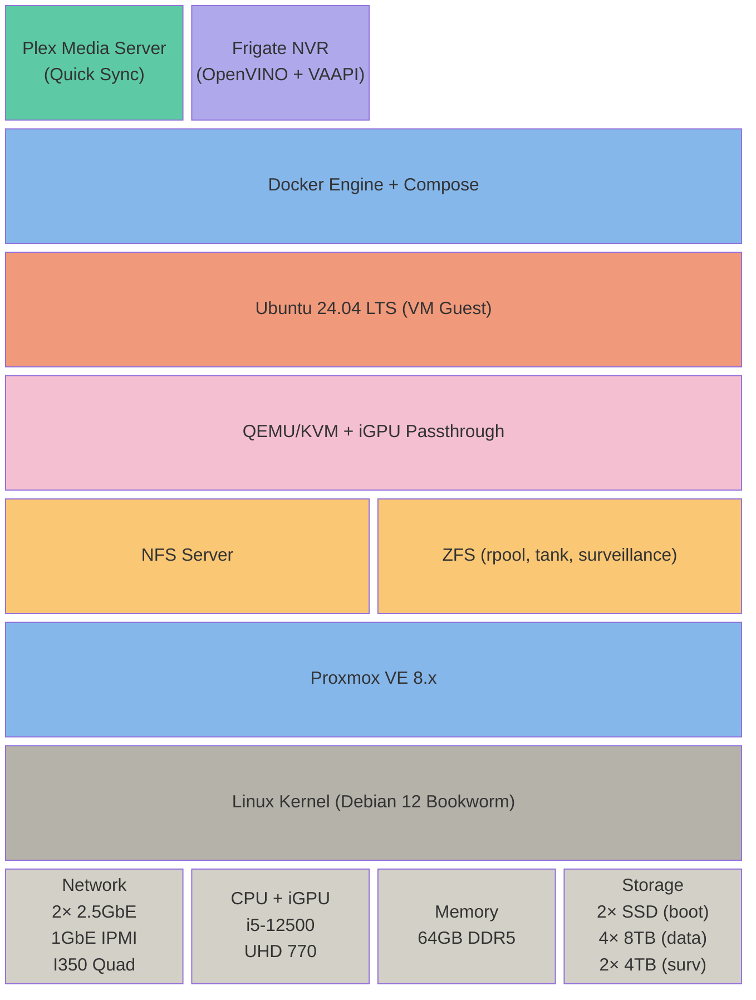
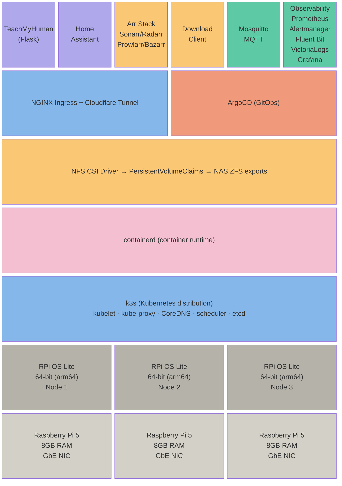

# Proxmox NAS + RPi k3s Cluster — Project Architecture Document

## Overview

This document captures the complete architecture for a two-system homelab infrastructure:

1. **Proxmox NAS/Hypervisor** — A DIY build in a Jonsbo N5 chassis replacing a Synology DS918+ and decommissioning an i7-7700K/RTX 2080 desktop. Runs Plex and Frigate NVR.
2. **Raspberry Pi 5 k3s Cluster** — A 3-node Kubernetes cluster running application workloads, media management, home automation, and observability. Stores persistent data on the NAS via NFS.

Both systems are connected through a UniFi network stack with VLAN segmentation for security and traffic isolation.

---

## Goals

- Replace the Synology DS918+ with a Proxmox-based NAS
- Consolidate Plex, Frigate NVR, and the Arr stack onto managed infrastructure
- Decommission the i7-7700K/RTX 2080 desktop and sell parts
- Run TeachMyHuman Flask app, Home Assistant, and supporting services on a k3s cluster
- Build hands-on Proxmox, ZFS, Kubernetes, and GitOps experience relevant to a Platform Engineer role (targeting Vultr)
- Maximize storage density, keep costs reasonable, prioritize quiet operation

---

## Hardware

### NAS Server — Jonsbo N5 Build

| Component | Part | Price |
|---|---|---|
| Chassis | Jonsbo N5 (12× 3.5" HDD + 4× 2.5" SSD, E-ATX, ATX PSU) | $265 |
| Motherboard | ASUS Pro WS W680-ACE IPMI (ATX, W680, LGA 1700, DDR5, dual 2.5GbE, IPMI, 4× SATA + SlimSAS) | $405 |
| CPU | Intel Core i5-12500 (6C/12T, 65W, UHD 770 iGPU, Quick Sync, vPro) | $207 |
| RAM | 2× Crucial Pro 32GB (2×16GB) DDR5-6400 CL32 non-ECC UDIMM — **64GB total** | $740 |
| Boot SSDs | 2× Kingston A400 480GB 2.5" SATA SSD (ZFS mirror) | ~$218 |
| PSU | Corsair RM1000x ATX 3.1, 1000W, fully modular | $180 |
| SlimSAS Cable | Micro SATA Cables SlimSAS 4i (SFF-8654) to 4× SATA, 50cm | $33 |
| **Existing** | Intel I350 quad-port GbE PCIe NIC | owned |
| **Existing** | 4× 8TB WD Pro 3.5" HDD | owned |
| **Existing** | 2× 4TB Seagate SkyHawk 3.5" HDD | owned |
| **Total** | | **~$2,048** |

### RPi 5 Cluster

| Component | Qty | Notes |
|---|---|---|
| Raspberry Pi 5 (8GB) | 3 | ARM64, GbE NIC each |
| Storage | — | All persistent data via NFS from NAS, local SD/USB for OS boot |
| Total cluster RAM | 24GB | |

### Network Equipment

| Device | Role |
|---|---|
| ATT DSL Modem | WAN uplink |
| UCG-Fiber | UniFi gateway / router / firewall, VLAN management |
| US-24 | Core managed switch (adopted into UniFi), VLAN trunking |
| USW Ultra 210W | PoE switch for cameras, all ports on VLAN 20 |

---

## NAS Server — Software Stack

### Layered Architecture



### Why Not Run Containers Directly on the Proxmox Host?

Proxmox manages its own networking, storage, and process space as a hypervisor. Running application workloads directly on it creates a messy boundary — Proxmox updates can break the container runtime, ZFS and container storage drivers can conflict, and isolation is lost. The standard approach is a VM inside Proxmox with Docker inside the VM.

### Container Runtime Decision: Docker VM (chosen over LXC and k3s-in-VM)

Three options were evaluated:

**Option 1 — LXC containers (Proxmox-native):** Near-zero overhead, Proxmox manages them natively, can bind-mount ZFS datasets directly. However, Frigate is finicky in LXC (expects Docker-based deployment), requires privileged containers with nesting, and configs aren't portable (no compose files). Rejected due to Frigate compatibility friction.

**Option 2 — Single Linux VM with Docker Compose (selected):** Full Docker ecosystem, mature official images for Frigate/Plex/Arr, well-documented iGPU passthrough via PCI passthrough + Docker `--device` flag. Compose files are portable and version-controllable. The VM tax (~1GB guest OS overhead) is acceptable with 64GB total RAM. ZFS pool access via NFS from host to VM works well for sequential media I/O patterns.

**Option 3 — k3s single-node in a VM:** Consistency with RPi cluster but adds significant overhead (kubelet, kube-proxy, CoreDNS) on top of the VM. Plex and Frigate are stateful services with hardware dependencies that don't benefit from Kubernetes orchestration. Running k3s on a single node doesn't exercise the distributed systems features that make Kubernetes interesting for career development. Rejected as overkill.

### Docker VM Resource Allocation

| Resource | Allocation | Remaining for Proxmox + ZFS ARC |
|---|---|---|
| RAM | ~20GB | ~42GB for host + ZFS ARC |
| CPU cores | 6 of 12 threads | 6 threads for host operations |
| iGPU | PCI passthrough | Shared between Plex and Frigate via /dev/dri |

### iGPU Sharing

The UHD 770 iGPU is passed through to the Docker VM. Both Plex (Quick Sync transcoding) and Frigate (VAAPI video decode) access it via `/dev/dri/renderD128` using Docker's `--device` flag. This is a well-documented and stable configuration.

---

## ZFS Storage Architecture

### Pool Layout

| Pool | Drives | Configuration | Usable Capacity | Purpose |
|---|---|---|---|---|
| rpool (boot) | 2× Kingston A400 480GB SSD | ZFS mirror | ~480GB | Proxmox OS, VMs, containers |
| tank (data) | 4× 8TB WD Pro | RAIDZ2 | ~16TB | Media, downloads, k3s PVCs via NFS |
| surveillance | 2× 4TB Seagate SkyHawk | ZFS mirror | ~4TB | Frigate NVR recordings (local only) |

### SATA Connectivity

- 4× native SATA ports on the W680-ACE motherboard
- 4× additional SATA via SlimSAS SFF-8654 4i breakout cable
- Total: 8 SATA ports, 7 used (6 HDDs + 1 boot SSD pair)

### NFS Exports to k3s Cluster

The NAS exports ZFS datasets via NFS to the RPi k3s cluster for persistent storage:

| Export | Purpose |
|---|---|
| `tank/media` | Plex media libraries (also mounted locally in Docker VM) |
| `tank/downloads` | Download client working directory |
| `tank/k3s/arr` | Arr stack configs and databases |
| `tank/k3s/teachmyhuman` | TeachMyHuman Flask app data |
| `tank/k3s/homeassistant` | Home Assistant config directory |
| `tank/k3s/observability` | Prometheus, VictoriaLogs data |

The `surveillance` pool is **not exported** — it stays local to the NAS for Frigate only.

### NFS Design Note: Arr Stack File Moves

The Arr stack runs on the k3s cluster but accesses media and download directories via NFS. To ensure fast file imports (Radarr/Sonarr moving completed downloads into media libraries), the downloads and media directories should share a common parent NFS export or be on the same ZFS dataset. This allows moves to be instant renames rather than copy-and-delete operations across mount boundaries.

### Growth Path

- 12 bays in the Jonsbo N5 support expansion to 8+ data drives
- Adding 4 more 8TB drives as a second RAIDZ2 vdev to the `tank` pool doubles usable capacity to ~32TB
- An HBA card (e.g., LSI 9207-8i) in a PCIe slot adds 8 more SATA ports beyond the onboard 8

---

## RPi 5 Cluster — Software Stack

### Layered Architecture



### Why the Arr Stack Runs on k3s Instead of the NAS

The Arr stack (Sonarr, Radarr, Prowlarr, Bazarr, download client) was moved from the NAS Docker VM to the k3s cluster for several reasons:

- Reduces NAS VM workload — keeps the VM focused on Plex and Frigate which genuinely need iGPU access
- Arr apps are stateless web applications with small SQLite databases — they don't need hardware passthrough
- Proper Kubernetes lifecycle management (health checks, rolling updates, resource limits)
- More real workloads to practice k3s operations with — directly relevant to career goals
- Storage is accessed via NFS PVCs pointing back at the NAS, so there's no data locality penalty for sequential file operations

### k3s Cluster Resource Budget

| Service | Estimated RAM | Notes |
|---|---|---|
| k3s system (× 3 nodes) | ~1.5GB total | kubelet, kube-proxy, CoreDNS, metrics-server |
| NGINX Ingress Controller | 200-300MB | |
| Cloudflare Tunnel (cloudflared) | 50-100MB | |
| ArgoCD | 500MB-1GB | server, repo-server, app-controller, Redis |
| TeachMyHuman Flask App | 100-300MB | |
| Home Assistant Core | 300-500MB | |
| Mosquitto MQTT Broker | 10-30MB | |
| Sonarr | 150-250MB | |
| Radarr | 150-250MB | |
| Prowlarr | 100-150MB | |
| Bazarr | 100-150MB | |
| Download Client | 200-500MB | SABnzbd or qBittorrent |
| Prometheus + Alertmanager | 600MB-1.5GB | |
| Fluent Bit (DaemonSet × 3) | 60-90MB total | |
| VictoriaLogs | 200-400MB | |
| Grafana | 200-300MB | |
| **Estimated total** | **~4.5-7GB workloads + 1.5GB overhead = 6-8.5GB** | **Out of 24GB available** |

The cluster is using roughly a third of available memory, leaving ample room for spikes, OS buffers, and future additions (Qdrant, MongoDB, or other data stores can be brought in later).

---

## Services Architecture

### NAS Server Services

| Service | Runtime | Purpose |
|---|---|---|
| Plex Media Server | Docker container in VM | Media streaming with Quick Sync hardware transcoding via iGPU |
| Frigate NVR | Docker container in VM | 4× 4K camera surveillance, OpenVINO object detection on CPU, VAAPI hardware decode on iGPU |
| NFS Server | Proxmox host (or lightweight LXC) | Exports ZFS datasets to k3s cluster |

### k3s Cluster Services

| Service | Category | Purpose |
|---|---|---|
| NGINX Ingress Controller | Networking | TLS termination, path-based routing, production-standard ingress |
| Cloudflare Tunnel (cloudflared) | Networking | Exposes TeachMyHuman to the internet via Cloudflare edge |
| ArgoCD | CI/CD | GitOps continuous delivery pipeline |
| TeachMyHuman | Application | Flask-based learning platform |
| Home Assistant Core | Application | Home automation (WiFi/API/cloud integrations, no Zigbee/Z-Wave) |
| Mosquitto | Application | MQTT broker for Frigate → Home Assistant event notifications |
| Sonarr | Media management | TV show management |
| Radarr | Media management | Movie management |
| Prowlarr | Media management | Indexer management |
| Bazarr | Media management | Subtitle management |
| Download Client | Media management | SABnzbd or qBittorrent |
| Prometheus | Observability | Metrics collection and storage (career-relevant, industry standard) |
| Alertmanager | Observability | Alert routing for infrastructure alerts |
| Fluent Bit | Observability | Log collection (DaemonSet, ~20MB per node) |
| VictoriaLogs | Observability | Log storage and querying |
| Grafana | Observability | Dashboards for metrics and logs |

---

## Observability Stack

### Decision: Prometheus over VictoriaMetrics

Prometheus was chosen over VictoriaMetrics despite being heavier on memory. The reasoning is career alignment — Prometheus is the industry standard for Kubernetes metrics and what you'd encounter at Vultr and most production environments. PromQL, the pull-based scraping model, ServiceMonitor CRDs, and Alertmanager integration are all directly transferable skills.

### Decision: Fluent Bit + VictoriaLogs over Promtail + Loki

Promtail has been deprecated by Grafana in favor of Grafana Alloy. Rather than adopting a new tool, the existing Fluent Bit + VictoriaLogs pairing (already running for the Ollama stack) was kept. Fluent Bit is lightweight (~20MB per node, written in C, excellent ARM64 support) and VictoriaLogs is memory-efficient.

### Final Observability Stack

| Component | Role |
|---|---|
| Prometheus | Metrics collection and storage |
| Alertmanager | Alert routing (infrastructure alerts, not camera events) |
| Fluent Bit | Log collection (DaemonSet on each k3s node) |
| VictoriaLogs | Log storage and querying |
| Grafana | Unified dashboards for metrics and logs |

---

## Notification Architecture: Frigate → Home Assistant

Camera event notifications do **not** go through Alertmanager. The path is:

1. **Frigate** detects an event (person, car, etc.) in the Docker VM on the NAS
2. Frigate publishes the event to the **Mosquitto MQTT broker** running on the k3s cluster
3. **Home Assistant** (on k3s) subscribes to Frigate's MQTT topics
4. Home Assistant triggers automations and sends **push notifications** to phones via the HA companion app

This is the standard Frigate + HA integration — real-time, sub-second, purpose-built for camera events.

**Alertmanager** handles a different layer: infrastructure health alerts like "Frigate container crashed," "ZFS pool degraded," "k3s node unresponsive," or "disk usage above 85%."

---

## Ingress Decision: NGINX Ingress Controller

### Options Evaluated

**Traefik (k3s default):** Bundled with k3s, auto-discovers Ingress resources, built-in Let's Encrypt. However, uses its own IngressRoute CRDs which don't transfer to production environments using other ingress controllers. Rejected for career reasons.

**NGINX Ingress Controller (selected):** Most widely deployed ingress controller in production Kubernetes. Uses standard Kubernetes Ingress resources. Disabled Traefik at k3s install (`--disable traefik`), deploy NGINX ingress via Helm. Skills transfer directly to production clusters.

**Gateway API:** Newer Kubernetes-native standard, more expressive. However, requires a Gateway API implementation (Envoy, Cilium) that's too heavy for 3× RPi 5 nodes with 8GB each. Can be added later as a learning exercise.

### External Access Flow

Internet → Cloudflare Edge (TLS termination) → `cloudflared` tunnel agent (k3s pod) → NGINX Ingress Controller → TeachMyHuman Flask app

---

## Network Architecture

### Physical Topology

```
ATT DSL Modem
    │ WAN
    ▼
UCG-Fiber (UniFi Gateway)
    │ LAN trunk (VLAN 1, 20, 99)
    ▼
US-24 (Core Managed Switch)
    ├── NAS Server (2.5GbE LAN — VLAN 1)
    ├── NAS Server (2.5GbE Camera — VLAN 20)
    ├── NAS Server (1GbE IPMI — VLAN 99)
    ├── RPi 5 Node 1 (GbE — VLAN 1)
    ├── RPi 5 Node 2 (GbE — VLAN 1)
    ├── RPi 5 Node 3 (GbE — VLAN 1)
    ├── LAN clients (PCs, phones, TVs)
    └── Trunk to USW Ultra 210W
                ├── Camera 1 (4K PoE — VLAN 20)
                ├── Camera 2 (4K PoE — VLAN 20)
                ├── Camera 3 (4K PoE — VLAN 20)
                └── Camera 4 (4K PoE — VLAN 20)
```

### VLAN Configuration

| VLAN | Name | Subnet (example) | Devices | Purpose |
|---|---|---|---|---|
| 1 | Default LAN | 192.168.1.0/24 | NAS 2.5GbE (port 1), RPi 5 cluster, household devices | General traffic, Plex streaming, NFS, SMB |
| 20 | Cameras | 192.168.20.0/24 | NAS 2.5GbE (port 2), USW Ultra 210W, PoE cameras | Isolated camera feeds — no internet access |
| 99 | Management | 192.168.99.0/24 | NAS IPMI 1GbE, admin workstation | IPMI BMC — firewalled to admin devices only |

### Why No Dedicated Storage VLAN

A dedicated NFS storage VLAN was considered but deferred. At current scale, the math doesn't justify the complexity:

- RPi 5 GbE NICs max out at ~110MB/s each
- k3s workloads consuming NFS (Arr configs, app data, logs) are low-throughput
- The NAS's 2.5GbE LAN interface can saturate all three RPi connections simultaneously
- The heaviest NFS consumer (Arr stack moving downloads) is burst, not sustained

The I350 quad NIC has spare ports available to dedicate to a storage VLAN later if 10GbE is added or more storage clients join the network.

---

## Key Data Flows

| Flow | Path | Network |
|---|---|---|
| Plex streaming | ZFS tank → Plex (Quick Sync transcode) → 2.5GbE LAN → client devices | VLAN 1 |
| Frigate camera ingest | 4K cameras → USW Ultra 210W → 2.5GbE → Frigate (VAAPI + OpenVINO) → ZFS surveillance | VLAN 20 |
| Frigate notifications | Frigate → Mosquitto MQTT (k3s) → Home Assistant → phone push | VLAN 1 (NAS to k3s) |
| NFS storage | ZFS tank exports → NFS → NFS CSI (k3s) → pod PVCs | VLAN 1 |
| Arr media pipeline | Prowlarr search → Sonarr/Radarr grab → download client (NFS) → import to media library (NFS) | VLAN 1 |
| External access | Internet → Cloudflare → cloudflared (k3s) → NGINX ingress → TeachMyHuman | VLAN 1 + Cloudflare tunnel |
| IPMI management | Admin workstation → US-24 → IPMI BMC → NAS BIOS/console/power | VLAN 99 |
| Infrastructure alerts | Prometheus (k3s) scrapes NAS/k3s metrics → evaluates rules → Alertmanager → notification channel | VLAN 1 |

---

## Infrastructure Decommissioning

| Device | Action |
|---|---|
| Synology DS918+ | Replaced by Proxmox NAS build |
| i7-7700K / RTX 2080 desktop | Decommission, sell parts on /r/hardwareswap |
| Beelink SER8 (Ryzen 7 8745HS) | Repurpose or sell |
| Raspberry Pi 5 cluster (3× 8GB) | Retained — runs k3s workloads as described above |

---

## Future Considerations

- **ECC RAM:** Upgrade to DDR5 ECC UDIMMs when supply normalizes (currently constrained by AI-driven DRAM shortage)
- **GPU addition:** If Frigate CPU detection becomes a bottleneck beyond 4-6 cameras, add a low-power GPU (e.g., Tesla P4) to a PCIe slot
- **10GbE networking:** Would warrant a dedicated storage VLAN for NFS traffic
- **Storage expansion:** Add 4 more 8TB drives as a second RAIDZ2 vdev to `tank` pool (~32TB usable), add HBA card if exceeding 8 SATA ports
- **Qdrant / MongoDB:** Deferred from this project, can be added to k3s cluster later (headroom available)
- **Gateway API:** Can replace NGINX Ingress as a learning exercise once cluster is stable

---

## Build Assembly Order

1. Install CPU and RAM into the W680-ACE motherboard (RAM in all 4 DIMM slots — A1, A2, B1, B2 for 64GB dual-channel)
2. Mount motherboard into the Jonsbo N5
3. Install both A400 SSDs in the 2.5" mounting positions
4. Route PSU cables — SATA and Molex to backplanes FIRST, then motherboard power cables
5. Install and secure the PSU (cables must be routed before PSU is seated due to N5's layout)
6. Install Intel I350 quad NIC in a PCIe 3.0 x4 slot
7. Connect SlimSAS breakout cable from the motherboard's SlimSAS port to backplane SATA data connections
8. Connect SATA data cables from the 4 native SATA ports to backplane/drives
9. Install HDDs into backplane bays
10. First boot — enter BIOS, verify all hardware detected, configure boot order
11. Install Proxmox VE — select ZFS (mirror) on the two A400 SSDs as root filesystem
12. Create ZFS pools (RAIDZ2 for data, mirror for surveillance)
13. Configure networking (VLANs, bridges for camera isolation)
14. Create Docker VM, configure iGPU passthrough, install Docker
15. Deploy Plex and Frigate via compose
16. Configure NFS exports for k3s cluster
17. Bootstrap k3s on RPi 5 cluster (disable Traefik, deploy NGINX ingress)
18. Install NFS CSI driver, deploy ArgoCD
19. Deploy application workloads via ArgoCD GitOps
20. Deploy observability stack (Prometheus, Alertmanager, Fluent Bit, VictoriaLogs, Grafana)
21. Configure Cloudflare tunnel for TeachMyHuman external access
22. Set up Frigate → MQTT → Home Assistant notification pipeline