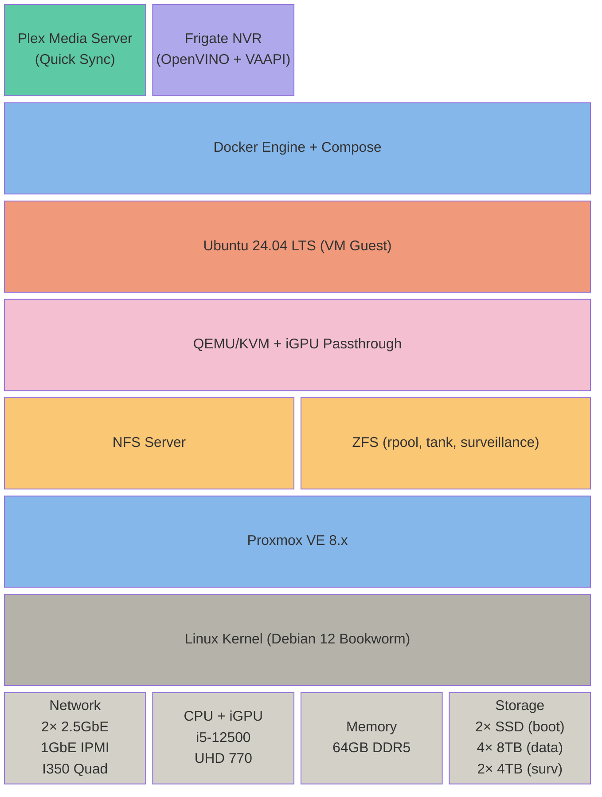
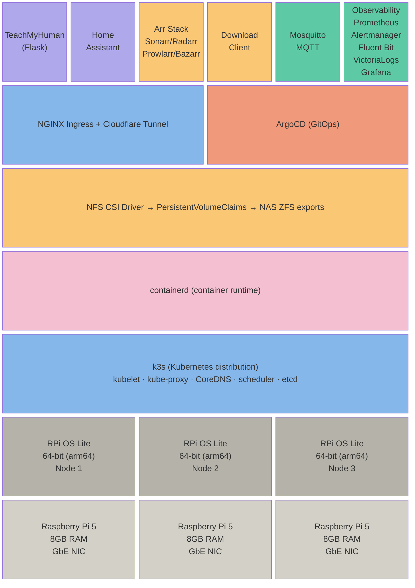

# NAS Server — Layered Architecture

```mermaid
block-beta
    columns 4

    %% Top layer - Application containers
    Plex["Plex Media Server\n(Quick Sync)"] Frigate["Frigate NVR\n(OpenVINO + VAAPI)"]
    space space

    %% Container runtime
    Docker["Docker Engine + Compose"]:4

    %% Guest OS
    Ubuntu["Ubuntu 24.04 LTS (VM Guest)"]:4

    %% Virtualization layer
    QEMU["QEMU/KVM + iGPU Passthrough"]:4

    %% Proxmox + host services
    NFS["NFS Server"]:2 ZFS["ZFS (rpool, tank, surveillance)"]:2

    %% Proxmox base
    PVE["Proxmox VE 8.x"]:4

    %% Kernel
    Kernel["Linux Kernel (Debian 12 Bookworm)"]:4

    %% Hardware
    Net["Network\n2× 2.5GbE\n1GbE IPMI\nI350 Quad"]:1 CPU_GPU["CPU + iGPU\ni5-12500\nUHD 770"]:1 RAM["Memory\n64GB DDR5"]:1 Storage["Storage\n2× SSD (boot)\n4× 8TB (data)\n2× 4TB (surv)"]:1

    style Plex fill:#5DCAA5,color:#04342C
    style Frigate fill:#AFA9EC,color:#26215C
    style Docker fill:#85B7EB,color:#042C53
    style Ubuntu fill:#F0997B,color:#4A1B0C
    style QEMU fill:#F4C0D1,color:#4B1528
    style NFS fill:#FAC775,color:#412402
    style ZFS fill:#FAC775,color:#412402
    style PVE fill:#85B7EB,color:#042C53
    style Kernel fill:#B4B2A9,color:#2C2C2A
    style Net fill:#D3D1C7,color:#2C2C2A
    style CPU_GPU fill:#D3D1C7,color:#2C2C2A
    style RAM fill:#D3D1C7,color:#2C2C2A
    style Storage fill:#D3D1C7,color:#2C2C2A
```

# RPi 5 Cluster — Layered Architecture

```mermaid
block-beta
    columns 6

    %% Top layer - Application pods
    TMH["TeachMyHuman\n(Flask)"]:1 HA["Home\nAssistant"]:1 Arr["Arr Stack\nSonarr/Radarr\nProwlarr/Bazarr"]:1 DL["Download\nClient"]:1 MQTT["Mosquitto\nMQTT"]:1 Obs["Observability\nPrometheus\nAlertmanager\nFluent Bit\nVictoriaLogs\nGrafana"]:1

    %% Kubernetes service layer
    Ingress["NGINX Ingress + Cloudflare Tunnel"]:3 ArgoCD["ArgoCD (GitOps)"]:3

    %% Storage provisioning
    NFSCSI["NFS CSI Driver → PersistentVolumeClaims → NAS ZFS exports"]:6

    %% Container runtime
    Containerd["containerd (container runtime)"]:6

    %% Kubernetes layer
    K3S["k3s (Kubernetes distribution)\nkubelet · kube-proxy · CoreDNS · scheduler · etcd"]:6

    %% OS layer
    Node1["RPi OS Lite\n64-bit (arm64)\nNode 1"]:2 Node2["RPi OS Lite\n64-bit (arm64)\nNode 2"]:2 Node3["RPi OS Lite\n64-bit (arm64)\nNode 3"]:2

    %% Hardware layer
    HW1["Raspberry Pi 5\n8GB RAM\nGbE NIC"]:2 HW2["Raspberry Pi 5\n8GB RAM\nGbE NIC"]:2 HW3["Raspberry Pi 5\n8GB RAM\nGbE NIC"]:2

    style TMH fill:#AFA9EC,color:#26215C
    style HA fill:#AFA9EC,color:#26215C
    style Arr fill:#FAC775,color:#412402
    style DL fill:#FAC775,color:#412402
    style MQTT fill:#5DCAA5,color:#04342C
    style Obs fill:#5DCAA5,color:#04342C
    style Ingress fill:#85B7EB,color:#042C53
    style ArgoCD fill:#F0997B,color:#4A1B0C
    style NFSCSI fill:#FAC775,color:#412402
    style Containerd fill:#F4C0D1,color:#4B1528
    style K3S fill:#85B7EB,color:#042C53
    style Node1 fill:#B4B2A9,color:#2C2C2A
    style Node2 fill:#B4B2A9,color:#2C2C2A
    style Node3 fill:#B4B2A9,color:#2C2C2A
    style HW1 fill:#D3D1C7,color:#2C2C2A
    style HW2 fill:#D3D1C7,color:#2C2C2A
    style HW3 fill:#D3D1C7,color:#2C2C2A
```