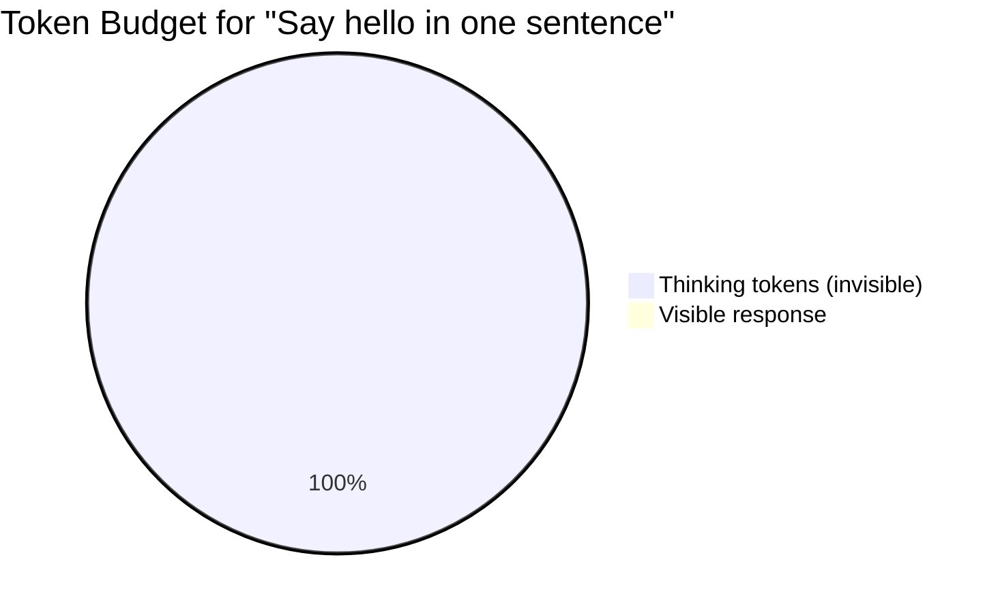
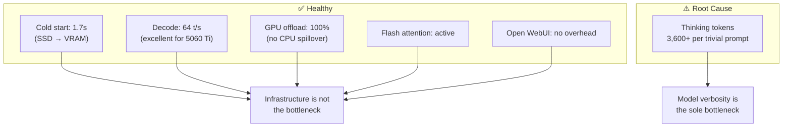

# Ollama Latency Diagnostic — Results Summary

**Date:** March 3, 2026  
**Host:** box01 (Ubuntu 24.04)  
**GPU:** NVIDIA RTX 5060 Ti — 16 GB VRAM  
**Model Tested:** qwen3.5:9b (Q4, 6.6 GB on disk)  
**Stack:** Rootless containerd → nerdctl compose → Ollama → Open WebUI

---

## Problem Statement

Response times through Open WebUI felt slow when prompting Ollama models. Before tuning anything, we needed to identify whether the bottleneck was infrastructure (container overhead, GPU offload, cold starts) or model behavior (token generation patterns).

## Diagnostic Approach

The request path from user to GPU has multiple layers, any of which could introduce latency:


We tested from the bottom up — starting closest to the GPU and working outward — so each test isolates exactly one layer. A diagnostic script (`scripts/ollama-latency-bench.sh`) automated all six tests.

## Tests Performed

### Test 1 — Currently Loaded Models

Checked whether any model was resident in VRAM before testing. Ollama unloads models after 5 minutes of idle time by default, so if nothing is loaded, the first prompt pays a cold-start penalty while weights transfer from disk to VRAM.

**Result:** No models loaded. Confirmed the first request would be a cold start.

### Test 2 — Cold Start (Disk → VRAM → Inference)

Force-unloaded the model, then sent a prompt to measure worst-case latency: disk read into VRAM plus full inference.

**Result:**

| Metric | Value |
|---|---|
| Wall clock | 22,124 ms |
| Model load (disk → VRAM) | 1,669 ms |
| Prompt eval (prefill) | 34 ms (21 tokens) |
| Generation (decode) | 19,095 ms (1,218 tokens) |
| Decode throughput | 63.8 t/s |

The cold start load of 1.7 seconds is fast — SSD-backed storage makes model loading a non-issue. Prompt evaluation at 34 ms for 21 tokens is negligible. However, the model generated **1,218 tokens** for a prompt asking for two sentences, spending 19 seconds on decode alone.

### Test 3 — Warm Inference (Model Already in VRAM)

Sent the same prompt immediately after Test 2 while the model was still resident.

**Result:**

| Metric | Value |
|---|---|
| Wall clock | 19,691 ms |
| Model load | 107 ms (~0, as expected) |
| Prompt eval (prefill) | 32 ms (21 tokens) |
| Generation (decode) | 18,299 ms (1,171 tokens) |
| Decode throughput | 64.0 t/s |

With the cold-start penalty removed, wall time dropped only slightly — from 22s to 20s. The model load was effectively zero, confirming that cold starts are not the primary issue. Decode throughput held steady at 64 t/s, which is excellent for this GPU class.

### Test 4 — Flash Attention Verification

Checked that `OLLAMA_FLASH_ATTENTION=1` (set in compose.yml) was actually reaching the Ollama process inside the container.

**Result:** Confirmed active. Flash attention reduces KV cache memory usage and can improve throughput for longer contexts.

### Test 5 — GPU Offload Verification

Checked how many model layers were on GPU vs CPU. Partial offload (some layers on CPU) dramatically reduces throughput.

**Result:**

| Metric | Value |
|---|---|
| Total model size | 8.1 GB |
| VRAM allocated | 8.1 GB |
| GPU offload | 100% |

Full GPU offload — no CPU spillover. With ~14 GB usable VRAM (16 GB minus 2 GB overhead), the 8.1 GB model fits comfortably.

### Test 6 — Open WebUI Overhead

Sent the same prompt through Open WebUI's API to measure middleware latency (Python processing, OTEL tracing to Phoenix).

**Result:**

| Metric | Value |
|---|---|
| Open WebUI wall clock | 14,537 ms |
| Warm Ollama baseline | 19,691 ms |
| Overhead | −5,154 ms |

The negative overhead (Open WebUI was *faster*) indicates that Open WebUI applies generation parameters (likely a `num_predict` or `max_tokens` cap) that limit output length. It generated fewer tokens than the raw Ollama API call, which ran with defaults and let the model generate until it self-stopped.

## Root Cause Confirmation

A follow-up raw API call with full response inspection confirmed the diagnosis:

| Metric | Value |
|---|---|
| Wall clock | 61,205 ms |
| Tokens generated (`eval_count`) | **3,643** |
| Visible response | "Hello, and I hope you are having a wonderful day." |
| Thinking tokens | ~3,630 (invisible chain-of-thought reasoning) |

qwen3.5:9b is a **reasoning model** that produces `<think>...</think>` blocks before its visible answer. For a trivial prompt ("Say hello in one sentence"), the model generated over 3,600 tokens of internal deliberation about whether "Hello!" constitutes a grammatical sentence — then output a 10-word reply.



## Infrastructure Health Summary



| Component | Status | Detail |
|---|---|---|
| Cold start (model load) | ✅ Healthy | 1.7s from SSD — negligible |
| Decode throughput | ✅ Healthy | 64 t/s — strong for RTX 5060 Ti |
| GPU offload | ✅ Healthy | 100% on GPU, no CPU spillover |
| Flash attention | ✅ Active | Confirmed in container environment |
| Open WebUI overhead | ✅ Negligible | Actually faster (caps token output) |
| **Thinking tokens** | **⚠️ Root cause** | **3,600+ tokens of invisible reasoning per trivial prompt** |

## Next Steps (Phase 2 — Ollama Model Management)

The fix is about controlling model generation behavior, not infrastructure tuning.

1. **Control thinking tokens** — qwen3.5:9b supports `/no_think` to disable chain-of-thought reasoning. Create Modelfiles that disable thinking by default for casual use, keeping thinking-enabled variants for complex reasoning tasks.

2. **Set `num_predict` defaults** — cap maximum output tokens via Modelfile parameters to prevent runaway generation even when thinking is enabled.

3. **Benchmark all four models** — run the diagnostic script against gemma3:12b, qwen2.5-coder:14b, and deepseek-r1:14b to build a complete performance profile. Note that gemma3:12b and qwen2.5-coder:14b are not reasoning models and will not produce thinking tokens.

4. **Consider `OLLAMA_KEEP_ALIVE`** — while cold starts are fast (1.7s), adding `OLLAMA_KEEP_ALIVE=30m` to compose.yml eliminates them entirely for active use sessions.

## Diagnostic Script

The benchmark script is located at `scripts/ollama-latency-bench.sh` and can be run against any pulled model:

```bash
./scripts/ollama-latency-bench.sh                 # defaults to qwen3.5:9b
./scripts/ollama-latency-bench.sh gemma3:12b       # test a different model
./scripts/ollama-latency-bench.sh deepseek-r1:14b  # another reasoning model
```

It requires `curl` and `jq`. Test 6 (Open WebUI overhead) is optional and requires `OPENWEBUI_API_KEY` to be set. The key must be enabled via `ENABLE_API_KEYS=True` in the open-webui environment configuration.
