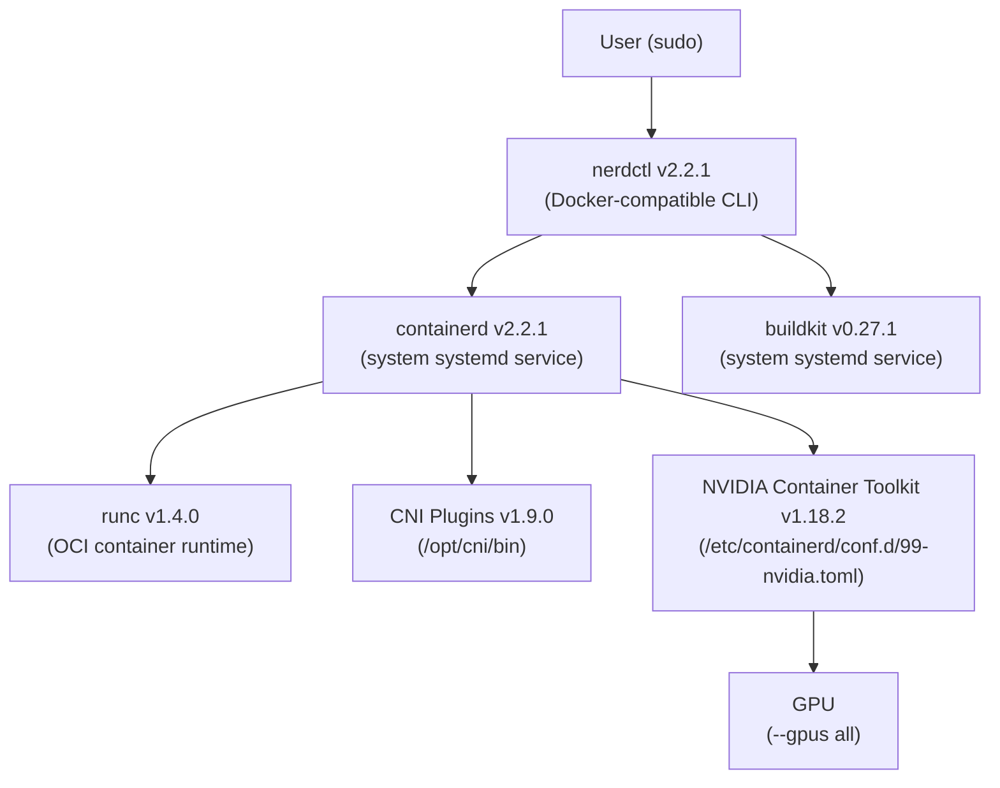
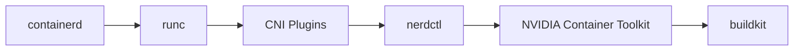

# Rootful Container Infrastructure Setup Guide
**OS:** Ubuntu 24.04  
**Host:** media-01 / box01  
**Date:** March 2026

---

## Overview

This guide covers the full installation of a rootful container runtime stack with NVIDIA GPU support on Ubuntu 24.04. In rootful mode, the container daemon runs as root and container operations require `sudo`. This is the simpler of the two setup methods and is appropriate for dedicated servers where the security trade-offs of running as root are acceptable.

By the end of this guide you will have:
- containerd, runc, CNI plugins, nerdctl, and buildkit installed from upstream sources
- NVIDIA GPU passthrough working via `--gpus all`
- The stack surviving reboots

---

## Architecture



---

## Prerequisites

Before starting, ensure NVIDIA drivers are installed and `nvidia-smi` works on the host:

```bash
nvidia-smi
```

---

## Installation Order

The stack must be installed in dependency order:



---

## Component Versions

| Component | Version | Source |
|-----------|---------|--------|
| containerd | 2.2.1 | github.com/containerd/containerd |
| runc | 1.4.0 | github.com/opencontainers/runc |
| CNI plugins | 1.9.0 | github.com/containernetworking/plugins |
| nerdctl | 2.2.1 | github.com/containerd/nerdctl |
| NVIDIA Container Toolkit | 1.18.2 | nvidia.github.io/libnvidia-container |
| buildkit | 0.27.1 | github.com/moby/buildkit |

---

## Step 1 – containerd v2.2.1

containerd is a CNCF-graduated container runtime, installed directly from GitHub releases rather than Docker's apt repo.

```bash
wget https://github.com/containerd/containerd/releases/download/v2.2.1/containerd-2.2.1-linux-amd64.tar.gz
sudo tar -C /usr/local -xzf containerd-2.2.1-linux-amd64.tar.gz

sudo wget -O /etc/systemd/system/containerd.service \
  https://raw.githubusercontent.com/containerd/containerd/main/containerd.service

sudo systemctl daemon-reload
sudo systemctl enable --now containerd
```

**Verify:** `containerd --version`

---

## Step 2 – runc v1.4.0

runc is the low-level OCI container runtime that containerd uses to spawn containers.

```bash
wget https://github.com/opencontainers/runc/releases/download/v1.4.0/runc.amd64
sudo install -m 755 runc.amd64 /usr/local/sbin/runc
```

**Verify:** `runc --version`

---

## Step 3 – CNI Plugins v1.9.0

The official CNCF Container Networking Interface plugins provide single-node networking primitives (bridge, loopback, portmap, etc.). These are not multi-node overlay networks like Flannel or Calico — they handle basic container networking on a single host.

```bash
wget https://github.com/containernetworking/plugins/releases/download/v1.9.0/cni-plugins-linux-amd64-v1.9.0.tgz
sudo mkdir -p /opt/cni/bin
sudo tar -C /opt/cni/bin -xzf cni-plugins-linux-amd64-v1.9.0.tgz
```

**Verify:** `ls /opt/cni/bin`

---

## Step 4 – nerdctl v2.2.1

nerdctl is a Docker-compatible CLI for containerd. Install the minimal binary since all components are already installed individually with pinned versions.

```bash
wget https://github.com/containerd/nerdctl/releases/download/v2.2.1/nerdctl-2.2.1-linux-amd64.tar.gz
sudo tar -C /usr/local/bin -xzf nerdctl-2.2.1-linux-amd64.tar.gz
```

**Verify:** `nerdctl --version`

---

## Step 5 – NVIDIA Container Toolkit v1.18.2

The NVIDIA Container Toolkit bridges the GPU to the container runtime. It is installed via NVIDIA's apt repo.

```bash
curl -fsSL https://nvidia.github.io/libnvidia-container/gpgkey | \
  sudo gpg --dearmor -o /usr/share/keyrings/nvidia-container-toolkit-keyring.gpg

curl -s -L https://nvidia.github.io/libnvidia-container/stable/deb/nvidia-container-toolkit.list | \
  sed 's#deb https://#deb [signed-by=/usr/share/keyrings/nvidia-container-toolkit-keyring.gpg] https://#g' | \
  sudo tee /etc/apt/sources.list.d/nvidia-container-toolkit.list

sudo apt-get update && sudo apt-get install -y nvidia-container-toolkit
```

Configure containerd to use the NVIDIA runtime:

```bash
sudo nvidia-ctk runtime configure --runtime=containerd
sudo systemctl restart containerd
```

This writes the NVIDIA runtime config to `/etc/containerd/conf.d/99-nvidia.toml`:

```toml
version = 2

[plugins]
  [plugins."io.containerd.grpc.v1.cri"]
    [plugins."io.containerd.grpc.v1.cri".containerd]
      [plugins."io.containerd.grpc.v1.cri".containerd.runtimes]
        [plugins."io.containerd.grpc.v1.cri".containerd.runtimes.nvidia]
          privileged_without_host_devices = false
          runtime_engine = ""
          runtime_root = ""
          runtime_type = "io.containerd.runc.v2"
          [plugins."io.containerd.grpc.v1.cri".containerd.runtimes.nvidia.options]
            BinaryName = "/usr/bin/nvidia-container-runtime"
```

---

## Step 6 – buildkit v0.27.1

buildkit is required for `nerdctl build` to work. It is not available via apt and must be installed from GitHub releases.

```bash
curl -L "https://github.com/moby/buildkit/releases/download/v0.27.1/buildkit-v0.27.1.linux-amd64.tar.gz" \
  -o /tmp/buildkit.tar.gz
sudo tar -xzf /tmp/buildkit.tar.gz -C /usr/local/bin --strip-components=1
```

Create the systemd service:

```bash
sudo tee /etc/systemd/system/buildkitd.service > /dev/null <<EOF
[Unit]
Description=BuildKit daemon
After=network.target

[Service]
ExecStart=/usr/local/bin/buildkitd
Restart=always

[Install]
WantedBy=multi-user.target
EOF

sudo systemctl daemon-reload
sudo systemctl enable --now buildkitd
```

**Verify:** `sudo systemctl status buildkitd`

> **Note:** buildkit defaults its cache to `/var/lib/buildkit`. If `/var` is small (e.g. under 50GB), move the cache to a larger partition:
> ```bash
> sudo systemctl stop buildkitd
> sudo mv /var/lib/buildkit /home/buildkit
> sudo ln -s /home/buildkit /var/lib/buildkit
> sudo systemctl start buildkitd
> ```

---

## Step 7 – Validate GPU Passthrough

```bash
sudo nerdctl run --rm --gpus all ubuntu nvidia-smi
```

You should see your GPU listed in the output.

Reboot and run the same command again to confirm everything persists:

```bash
sudo reboot
# after reboot:
sudo nerdctl run --rm --gpus all ubuntu nvidia-smi
```

---

## Verification Checklist

```bash
# Confirm all component versions
containerd --version
runc --version
nerdctl --version
buildkitd --version
sudo systemctl is-active containerd
sudo systemctl is-active buildkitd
sudo nerdctl run --rm --gpus all ubuntu nvidia-smi
```

---

## Useful Commands

| Action | Command |
|--------|---------|
| Run a container with GPU | `sudo nerdctl run --rm --gpus all <image> nvidia-smi` |
| Build an image | `sudo nerdctl build -t <tag> .` |
| List running containers | `sudo nerdctl ps` |
| View container logs | `sudo nerdctl logs -f <container_id>` |
| Stop a container | `sudo nerdctl stop <container_id>` |
| List images | `sudo nerdctl images` |
| Run compose stack | `sudo nerdctl compose up -d` |
| Restart compose stack | `sudo nerdctl compose restart` |

---

## Troubleshooting

### buildkit cache fills up /var

buildkit stores its build cache in `/var/lib/buildkit` by default. On systems where `/var` is a small partition this will fill up quickly, especially when building images with large dependencies like PyTorch.

Fix: relocate the cache to a larger partition and symlink:

```bash
sudo systemctl stop buildkitd
sudo mv /var/lib/buildkit /home/buildkit
sudo ln -s /home/buildkit /var/lib/buildkit
sudo systemctl start buildkitd
```

> Avoid creating circular symlinks. Verify with `ls -la /var/lib/buildkit` before starting buildkitd.

---

### NVIDIA runtime not available after configuration

If `sudo nerdctl run --gpus all ...` fails, verify the NVIDIA runtime config was written correctly:

```bash
cat /etc/containerd/conf.d/99-nvidia.toml
sudo systemctl restart containerd
sudo nerdctl run --rm --gpus all ubuntu nvidia-smi
```

---

### libnvcuvid / CUDA error on specific streams

If applying GPU acceleration globally to all ffmpeg streams (e.g. in Frigate NVR), detection streams will fail with:

```
Cannot load libnvcuvid.so.1
Failed loading nvcuvid.
Failed setup for format cuda: hwaccel initialisation returned error.
```

Fix: only apply `hwaccel_args: preset-nvidia-h264` to record (main) streams. Detection (sub) streams must use CPU decoding. Set the global ffmpeg hwaccel to empty and apply per input:

```yaml
ffmpeg:
  hwaccel_args: ""   # Global empty — applied per input only

cameras:
  my_camera:
    ffmpeg:
      inputs:
        - path: rtsp://...main
          roles: [record]
          hwaccel_args: preset-nvidia-h264   # GPU for record only
        - path: rtsp://...sub
          roles: [detect]
          # No hwaccel_args — CPU decoding for detect
```

---

## Key Takeaways

- **No Docker repo needed** — all components installed from upstream GitHub releases or NVIDIA's own repo
- **Installation order matters** — containerd → runc → CNI → nerdctl → NVIDIA toolkit → buildkit
- **`nvidia-ctk runtime configure --runtime=containerd`** writes to `/etc/containerd/conf.d/99-nvidia.toml`, not the main containerd config
- **containerd and buildkitd run as systemd services** and persist across reboots automatically
- **`--gpus all`** flag passed to `nerdctl run` enables GPU access inside containers
- **buildkit cache may need relocation** if `/var` is small — symlink `/var/lib/buildkit → /home/buildkit`
- **GPU hwaccel should only be applied to record streams** — detect streams require CPU decoding
