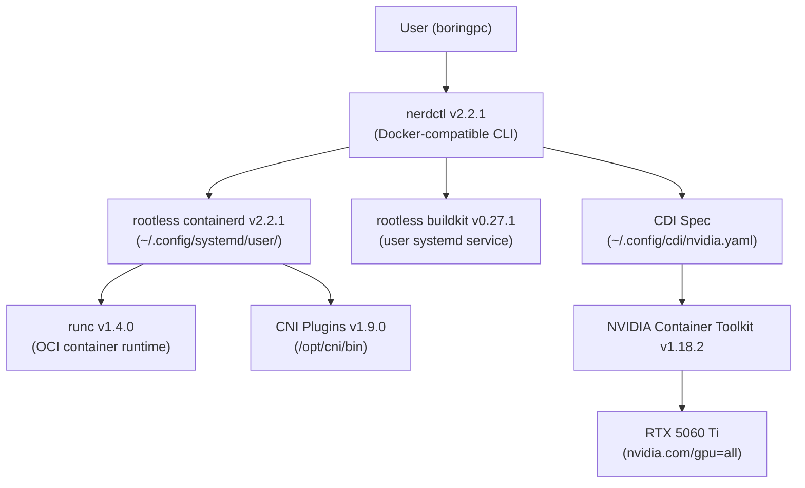
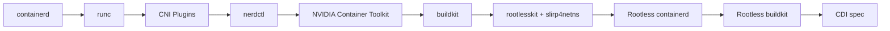
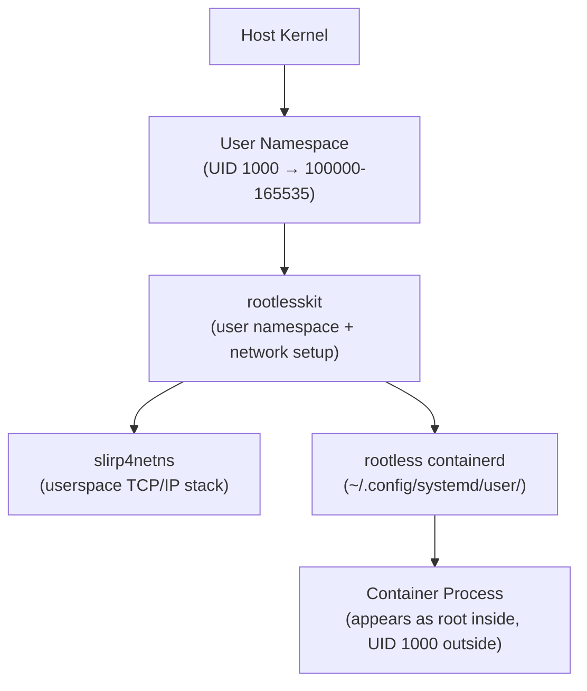
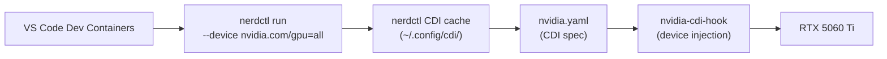

# Rootless Container Infrastructure Setup Guide
**OS:** Ubuntu 24.04  
**Host:** box01  
**Date:** March 2026

---

## Overview

This guide covers the full installation of a rootless container runtime stack with NVIDIA GPU support on Ubuntu 24.04. Rootless mode allows containers to run without `sudo`, improving security by ensuring container processes cannot escalate to root on the host.

By the end of this guide you will have:
- containerd, runc, CNI plugins, nerdctl, and buildkit installed from upstream sources
- NVIDIA GPU passthrough working in rootless mode via CDI
- VS Code Dev Containers working with GPU access

---

## Architecture



---

## Prerequisites

Before starting, ensure NVIDIA drivers are installed and `nvidia-smi` works on the host:

```bash
nvidia-smi
```

Also verify your user has subuid/subgid ranges configured (required for rootless):

```bash
cat /etc/subuid
cat /etc/subgid
# Expected output: boringpc:100000:65536
```

---

## Installation Order

The stack must be installed in dependency order:



---

## Component Versions

| Component | Version | Source |
|-----------|---------|--------|
| containerd | 2.2.1 | github.com/containerd/containerd |
| runc | 1.4.0 | github.com/opencontainers/runc |
| CNI plugins | 1.9.0 | github.com/containernetworking/plugins |
| nerdctl | 2.2.1 | github.com/containerd/nerdctl |
| NVIDIA Container Toolkit | 1.18.2 | nvidia.github.io/libnvidia-container |
| buildkit | 0.27.1 | github.com/moby/buildkit |
| rootlesskit | 2.3.6 | github.com/rootless-containers/rootlesskit |
| slirp4netns | 1.3.3 | github.com/rootless-containers/slirp4netns |

---

## Phase 1 – System-Level Stack

These components are installed system-wide (with sudo) and are required by the rootless setup.

### Step 1 – containerd v2.2.1

containerd is a CNCF-graduated container runtime, installed directly from GitHub releases rather than Docker's apt repo.

```bash
wget https://github.com/containerd/containerd/releases/download/v2.2.1/containerd-2.2.1-linux-amd64.tar.gz
sudo tar -C /usr/local -xzf containerd-2.2.1-linux-amd64.tar.gz

sudo wget -O /etc/systemd/system/containerd.service \
  https://raw.githubusercontent.com/containerd/containerd/main/containerd.service

sudo systemctl daemon-reload
sudo systemctl enable --now containerd
```

**Verify:** `containerd --version`

---

### Step 2 – runc v1.4.0

runc is the low-level OCI container runtime that containerd uses to spawn containers.

```bash
wget https://github.com/opencontainers/runc/releases/download/v1.4.0/runc.amd64
sudo install -m 755 runc.amd64 /usr/local/sbin/runc
```

**Verify:** `runc --version`

---

### Step 3 – CNI Plugins v1.9.0

The official CNCF Container Networking Interface plugins provide single-node networking primitives (bridge, loopback, portmap, etc.).

```bash
wget https://github.com/containernetworking/plugins/releases/download/v1.9.0/cni-plugins-linux-amd64-v1.9.0.tgz
sudo mkdir -p /opt/cni/bin
sudo tar -C /opt/cni/bin -xzf cni-plugins-linux-amd64-v1.9.0.tgz
```

**Verify:** `ls /opt/cni/bin`

---

### Step 4 – nerdctl v2.2.1

nerdctl is a Docker-compatible CLI for containerd. Install the minimal binary since components are already installed individually.

```bash
wget https://github.com/containerd/nerdctl/releases/download/v2.2.1/nerdctl-2.2.1-linux-amd64.tar.gz
sudo tar -C /usr/local/bin -xzf nerdctl-2.2.1-linux-amd64.tar.gz
```

**Verify:** `nerdctl --version`

---

### Step 5 – NVIDIA Container Toolkit v1.18.2

The NVIDIA Container Toolkit bridges the GPU to the container runtime.

```bash
curl -fsSL https://nvidia.github.io/libnvidia-container/gpgkey | \
  sudo gpg --dearmor -o /usr/share/keyrings/nvidia-container-toolkit-keyring.gpg

curl -s -L https://nvidia.github.io/libnvidia-container/stable/deb/nvidia-container-toolkit.list | \
  sed 's#deb https://#deb [signed-by=/usr/share/keyrings/nvidia-container-toolkit-keyring.gpg] https://#g' | \
  sudo tee /etc/apt/sources.list.d/nvidia-container-toolkit.list

sudo apt-get update && sudo apt-get install -y nvidia-container-toolkit

sudo nvidia-ctk runtime configure --runtime=containerd
sudo systemctl restart containerd
```

---

### Step 6 – buildkit v0.27.1

buildkit is required for `nerdctl build` to work.

```bash
curl -L "https://github.com/moby/buildkit/releases/download/v0.27.1/buildkit-v0.27.1.linux-amd64.tar.gz" \
  -o /tmp/buildkit.tar.gz
sudo tar -xzf /tmp/buildkit.tar.gz -C /usr/local/bin --strip-components=1
```

Create the systemd service:

```bash
sudo tee /etc/systemd/system/buildkitd.service > /dev/null <<EOF
[Unit]
Description=BuildKit daemon
After=network.target

[Service]
ExecStart=/usr/local/bin/buildkitd
Restart=always

[Install]
WantedBy=multi-user.target
EOF

sudo systemctl daemon-reload
sudo systemctl enable --now buildkitd
```

**Verify:** `sudo systemctl status buildkitd`

---

### Step 7 – Validate System GPU Passthrough

```bash
sudo nerdctl run --rm --gpus all ubuntu nvidia-smi
```

Reboot and run again to confirm persistence.

---

## Phase 2 – Rootless Mode

Rootless mode runs containers entirely within the user's namespace. No sudo is required for day-to-day container operations.



### Step 8 – rootlesskit v2.3.6

rootlesskit provides the user namespace and network plumbing for rootless containers.

```bash
wget https://github.com/rootless-containers/rootlesskit/releases/download/v2.3.6/rootlesskit-x86_64.tar.gz
sudo tar -xzf rootlesskit-x86_64.tar.gz -C /usr/local/bin
```

---

### Step 9 – slirp4netns v1.3.3

slirp4netns provides userspace networking for rootless containers.

```bash
wget https://github.com/rootless-containers/slirp4netns/releases/download/v1.3.3/slirp4netns-x86_64
sudo install -m 755 slirp4netns-x86_64 /usr/local/bin/slirp4netns
```

---

### Step 10 – Install Rootless containerd

```bash
# Check prerequisites
containerd-rootless-setuptool.sh check

# Install rootless containerd as a user systemd service
containerd-rootless-setuptool.sh install

# Enable linger so the service starts without an active login session
sudo loginctl enable-linger $USER
```

This creates `~/.config/systemd/user/containerd.service`. The rootless containerd socket is at `/run/user/1000/containerd.sock`.

**Verify:**

```bash
systemctl --user status containerd
nerdctl info
```

---

### Step 11 – Configure NVIDIA for Rootless containerd

`nvidia-ctk` hardcodes system paths and cannot be used directly for rootless config. The config must be created manually.

The rootless containerd script bind-mounts `~/.config/containerd` over `/etc/containerd` inside the user namespace, making user configs visible.

**Update the imports path in the main config:**

```bash
# The containerd-rootless-setuptool generates this file, update imports to point to user conf.d
sed -i "s|imports = \['/etc/containerd/conf.d/\*.toml'\]|imports = ['$HOME/.config/containerd/conf.d/*.toml']|" \
  $HOME/.config/containerd/config.toml
```

**Create the NVIDIA runtime config using containerd v3 plugin names:**

```bash
mkdir -p $HOME/.config/containerd/conf.d

cat > $HOME/.config/containerd/conf.d/99-nvidia.toml << 'EOF'
version = 3

[plugins]
  [plugins.'io.containerd.cri.v1.runtime']
    [plugins.'io.containerd.cri.v1.runtime'.containerd]
      [plugins.'io.containerd.cri.v1.runtime'.containerd.runtimes]
        [plugins.'io.containerd.cri.v1.runtime'.containerd.runtimes.nvidia]
          privileged_without_host_devices = false
          runtime_type = "io.containerd.runc.v2"
          [plugins.'io.containerd.cri.v1.runtime'.containerd.runtimes.nvidia.options]
            BinaryName = "/usr/bin/nvidia-container-runtime"
EOF
```

> **Important:** The plugin key must use `io.containerd.cri.v1.runtime` (version 3 format), not `io.containerd.grpc.v1.cri` (version 2 format). Using the wrong version causes the NVIDIA runtime to be silently ignored.

Restart rootless containerd:

```bash
systemctl --user daemon-reload
systemctl --user restart containerd
```

---

### Step 12 – Rootless buildkit

```bash
CONTAINERD_NAMESPACE=default containerd-rootless-setuptool.sh install-buildkit-containerd
```

Using `CONTAINERD_NAMESPACE=default` ensures built images are visible to `nerdctl images` without needing a namespace flag. This creates a `default-buildkit.service` user systemd service listening on `/run/user/1000/buildkit-default/buildkitd.sock`.

If a redundant `buildkit.service` was also created, disable it:

```bash
systemctl --user disable --now buildkit.service
```

---

## Phase 3 – CDI (Container Device Interface) for GPU

CDI is the standard mechanism for exposing devices like GPUs to containers. nerdctl uses CDI for the `--device nvidia.com/gpu=all` syntax used by VS Code Dev Containers.



### Step 13 – Generate CDI Spec

```bash
sudo nvidia-ctk cdi generate --output=/etc/cdi/nvidia.yaml
```

**Verify the spec was generated:**

```bash
nvidia-ctk cdi list
# Expected output:
# nvidia.com/gpu=0
# nvidia.com/gpu=GPU-xxxxxxxx-xxxx-xxxx-xxxx-xxxxxxxxxxxx
# nvidia.com/gpu=all
```

---

### Step 14 – Place CDI Spec in Rootless Search Path

> **Why this step is necessary:** nerdctl in rootless mode searches for CDI specs in `~/.config/cdi/` and `/run/user/1000/cdi/` by default — **not** `/etc/cdi/` or `/var/run/cdi/`. The rootless user namespace does not have access to those system paths.

```bash
mkdir -p ~/.config/cdi
cp /etc/cdi/nvidia.yaml ~/.config/cdi/nvidia.yaml
```

`~/.config/cdi/` is persistent across reboots. No symlinks or tmpfs hacks required.

**Verify CDI works in rootless mode:**

```bash
nerdctl run --rm --device nvidia.com/gpu=all ubuntu nvidia-smi
```

---

### Step 15 – Load AppArmor Profile

```bash
sudo nerdctl apparmor load
sudo apparmor_status | grep nerdctl
# Expected: nerdctl-default
```

---

### CDI Spec Maintenance

If you ever update the NVIDIA driver, regenerate and copy the CDI spec:

```bash
sudo nvidia-ctk cdi generate --output=/etc/cdi/nvidia.yaml
cp /etc/cdi/nvidia.yaml ~/.config/cdi/nvidia.yaml
```

---

## Phase 4 – VS Code Dev Containers

### Step 16 – VS Code Settings

Add to VS Code `settings.json` (`Ctrl+Shift+P` → "Open User Settings (JSON)"):

```json
{
  "dev.containers.dockerPath": "nerdctl",
  "dev.containers.dockerComposePath": "nerdctl compose",
  "dev.containers.dockerSocketPath": "/run/user/1000/containerd.sock"
}
```

---

## Troubleshooting

### CDI device injection failed: unresolvable CDI devices nvidia.com/gpu=all

nerdctl in rootless mode uses different CDI spec directories than the system defaults. The fix is to place the CDI spec in the user config directory:

```bash
mkdir -p ~/.config/cdi
cp /etc/cdi/nvidia.yaml ~/.config/cdi/nvidia.yaml
```

Root cause: nerdctl's rootless default CDI spec dirs are `~/.config/cdi` and `/run/user/1000/cdi`, not `/etc/cdi` or `/var/run/cdi`.

---

### NVIDIA runtime not being used by rootless containerd

The rootless containerd config is version 3, but `nvidia-ctk runtime configure` generates a version 2 config. Version 2 uses `io.containerd.grpc.v1.cri` as the plugin key; version 3 uses `io.containerd.cri.v1.runtime`. The mismatch causes the NVIDIA runtime to be silently ignored.

Fix: manually create `~/.config/containerd/conf.d/99-nvidia.toml` with `version = 3` and the correct plugin key (see Step 11).

---

### libnvcuvid / CUDA error on detect streams (Frigate)

If applying `preset-nvidia-h264` globally to all ffmpeg streams, the detect (sub) stream will fail with:

```
Cannot load libnvcuvid.so.1
Failed loading nvcuvid.
```

Fix: only apply `hwaccel_args: preset-nvidia-h264` to record (main) streams. Detect streams must use CPU decoding. Set global `ffmpeg: hwaccel_args: ""` and apply per record input.

---

### containerd v3 config plugin key reference

| containerd version | Plugin key for CRI runtime |
|-------------------|---------------------------|
| v1.x (version 2 config) | `io.containerd.grpc.v1.cri` |
| v2.x (version 3 config) | `io.containerd.cri.v1.runtime` |

---

## Key Takeaways

- **Installation order matters** — containerd → runc → CNI → nerdctl → NVIDIA toolkit → buildkit → rootlesskit → slirp4netns → rootless containerd → rootless buildkit → CDI
- **Rootless CDI spec location** — nerdctl rootless defaults to `~/.config/cdi/`, not `/etc/cdi/`. Copy the spec there.
- **containerd config version matters** — v3 config uses different plugin keys than v2. `nvidia-ctk` generates v2 format; rootless containerd uses v3. Always write the NVIDIA runtime config manually with `version = 3`.
- **No Docker repo needed** — all components installed from upstream GitHub releases or NVIDIA's own repo
- **`--gpus all` vs `--device nvidia.com/gpu=all`** — `--gpus all` uses the NVIDIA container runtime directly; `--device nvidia.com/gpu=all` uses CDI. VS Code Dev Containers uses CDI, so the CDI spec must be in the rootless search path.
- **Rootless buildkit namespace** — use `CONTAINERD_NAMESPACE=default` when installing rootless buildkit so images are visible without a namespace flag
- **`loginctl enable-linger`** — required so rootless services start at boot without an active login session
